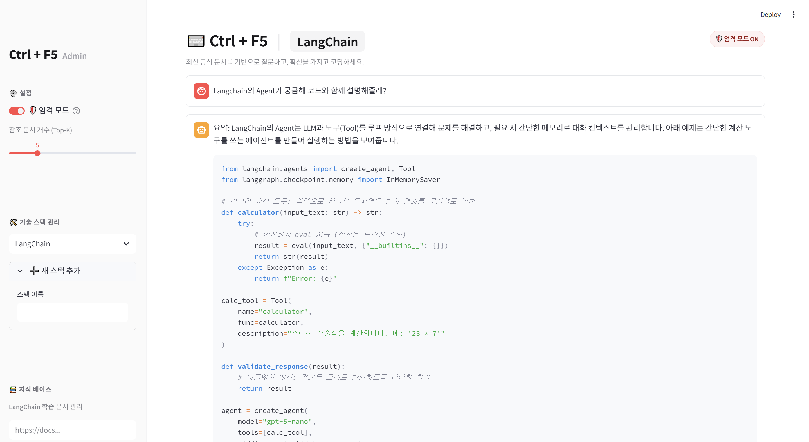
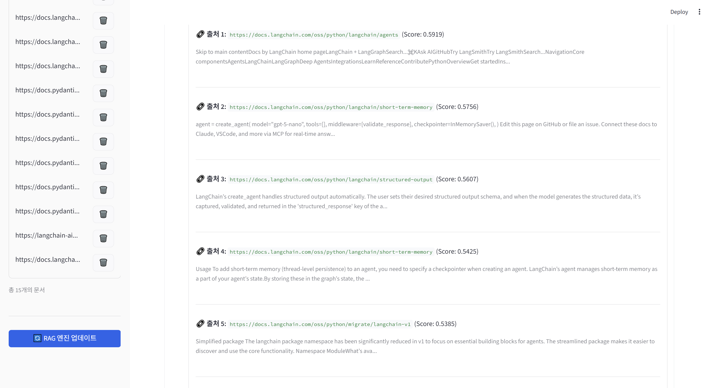
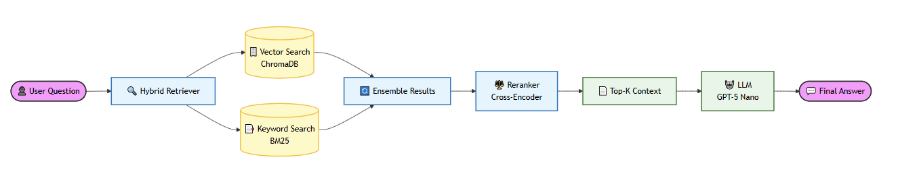

# ⌨️ Ctrl + F5 : Developer's RAG Assistant


 **최신 공식 문서를 기반으로, 확신할 수 있는 코드를 작성하세요.**

[](https://www.python.org/)
[](https://streamlit.io/)
[](https://www.langchain.com/)
[](https://openai.com/)

**Ctrl + F5**는 개발자가 새로운 기술 스택을 익히거나 디버깅할 때, **LLM의 환각(Hallucination)과 구버전 정보(Legacy Info) 문제**를 해결하기 위해 설계된 **RAG(검색 증강 생성) 기반 AI 어시스턴트**입니다.

사용자가 등록한 최신 기술 문서 URL을 실시간으로 학습하여, **가장 정확하고 최신 문법에 맞는 코드**를 제안합니다.

---

## 🎥 Demo Video

[](https://www.youtube.com/watch?v=PB5y2Q9V7mg)

> **[시연 영상 보러가기](https://www.youtube.com/watch?v=PB5y2Q9V7mg)**  
> *클릭하여 RAG 엔진의 동작 과정을 확인해보세요.*

---

## � Project Documents

> **[기획 및 중간보고서](YOUR_LINK_HERE)**  
> **[결과 보고서](YOUR_LINK_HERE)**  

---

## �📸 Screenshots

| **Main Interface** | **Admin & Knowledge Base** |
|:---:|:---:|
|  |  |
| *모던한 다크 그레이 & 블루 테마* | *URL 관리 및 RAG 엔진 업데이트* |

---

## ✨ Key Features

### 1. 🛡️ Strict Mode (엄격 모드)
* **Fact-Grounded Generation:** LLM의 일반적인 지식이 아닌, **제공된 문서(Context)**에 근거해서만 답변합니다.
* **No Lazy Referrals:** "링크를 참조하세요"와 같은 무책임한 답변을 차단하고, 내용을 요약하여 직접 설명합니다.
* **Fail-Safe:** 문서에 답이 없으면 솔직하게 "근거를 찾을 수 없음"을 알립니다.

### 2. 🧠 Advanced RAG Pipeline
단순 벡터 검색의 한계를 극복하기 위해 **하이브리드 검색 및 리랭킹** 기술을 적용했습니다.
* **Hybrid Search:** 의미 기반의 `Vector Search` (ChromaDB) + 키워드 기반의 `BM25` (Sparse)를 결합하여 검색 누락을 방지합니다.
* **Reranking:** 1차 검색된 문서들을 **Cross-Encoder(`BGE-Reranker-v2-m3`)** 모델로 정밀 재채점하여, 질문과 가장 연관성 높은 문서를 선별합니다.

### 3. 🌍 Multilingual Support (한글 최적화)
* **Embedding:** `BAAI/bge-m3` 모델을 사용하여 한글 질문으로도 영문 기술 문서를 정확하게 찾아냅니다.
* **Optimization:** 한국어 사용 환경에 맞춰 프롬프트와 검색 로직이 튜닝되어 있습니다.

### 4. ⚡ Performance & UX
* **Caching:** `@st.cache_resource`를 활용하여 무거운 AI 모델을 메모리에 상주시켜, 응답 속도를 최적화했습니다.
* **Developer Experience:** 코드 입력에 최적화된 UI, `Ctrl + Enter` 전송 단축키 지원, 직관적인 기술 스택 관리 기능을 제공합니다.

---

## 🛠️ Architecture

**Ctrl + F5**의 고도화된 RAG 파이프라인 구조도입니다. 하이브리드 검색과 리랭킹 기술을 결합하여 최적의 답변을 생성합니다.



## 📂 Project Structure
```
CtrlF5/
├── 📂 assets/              # CSS 스타일 및 정적 리소스
│   └── style.css          # 메인 스타일시트
├── 📂 core/                # 핵심 RAG 로직 및 비즈니스 로직
│   ├── callbacks.py       # 이벤트 핸들러 (버튼 클릭 등)
│   ├── database.py        # 벡터 DB 관리 및 문서 로딩
│   ├── engine.py          # RAG 검색 파이프라인 (LangChain)
│   ├── model_loader.py    # 모델 로딩 및 캐싱 (Singleton)
│   └── prompts.py         # 시스템 프롬프트 템플릿
├── 📂 ui/                  # UI 컴포넌트
│   ├── chat.py            # 채팅창 및 입력 영역
│   └── sidebar.py         # 사이드바 (설정 및 스택 관리)
├── .env                   # API Key 환경 변수
├── main.py                # 애플리케이션 진입점 (App Layout)
├── requirements.txt       # 의존성 패키지 목록
└── stacks_config.json     # 사용자 등록 스택/URL 데이터
```

## 🚀 Getting Started

### Prerequisites
* Python 3.10 이상
* OpenAI API Key

### Installation

1.  **Clone the Repository**
    ```bash
    git clone [https://github.com/chobaa/CtrlF5.git](https://github.com/chobaa/CtrlF5.git)
    cd CtrlF5
    ```

2.  **Create Virtual Environment (권장)**
    ```bash
    python -m venv venv
    source venv/bin/activate  # Mac/Linux
    venv\Scripts\activate   # Windows
    ```

3.  **Install Dependencies**
    ```bash
    pip install -r requirements.txt
    ```

4.  **Set Environment Variables**
    * Create a `.env` file in the root directory.
    ```env
    OPENAI_API_KEY=sk-your-api-key-here...
    ```

5.  **Run Application**
    ```bash
    streamlit run main.py
    ```

    ---

## 📖 Usage Guide

1.  **스택 추가:** 사이드바에서 `+ 새 스택 추가`를 눌러 기술 이름(예: `LangChain v0.3`)을 입력합니다.
2.  **문서 등록:** 학습시키고 싶은 공식 문서의 URL을 입력하고 추가합니다.
3.  **엔진 업데이트:** `🔄 RAG 엔진 업데이트` 버튼을 누르면 문서 수집(Scraping), 청킹(Chunking), 임베딩(Embedding)이 진행됩니다.
4.  **질문하기:** 메인 화면에서 코드를 붙여넣거나 질문을 입력하세요. (단축키: `Ctrl + Enter`)

---

## 🔧 Troubleshooting

* **초기 실행 속도가 느려요:**
    * 최초 실행 시 임베딩 모델(`bge-m3`)과 리랭커 모델(`bge-reranker`)을 다운로드하느라 시간이 소요될 수 있습니다. 이후에는 캐싱되어 즉시 실행됩니다.
* **답변이 없어요 (Strict Mode):**
    * Strict Mode는 문서에 내용이 없으면 답변하지 않습니다. 모드를 끄거나 관련 문서를 추가해주세요.

---

## 📄 License

This project is licensed under the MIT License. See the [LICENSE](LICENSE) file for details.